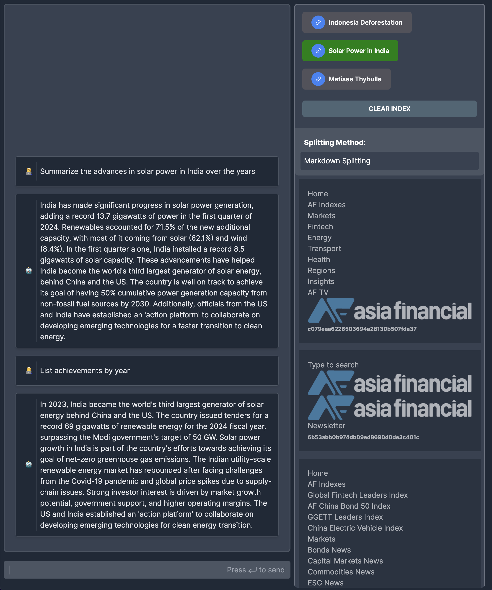

# RAG Chatbot

A chatbot with Retrieval Augmented Generation (RAG).

**Tech Stack**

1. [Vercel AI SDK](https://sdk.vercel.ai/)
2. [OpenAI API](https://platform.openai.com) – GPT-3.5 Turbo model
3. [Pinecone](https://www.pinecone.io/) vector database to store vector
   embeddings



## Development Build

Copy `.env.example` to `.env.local` and fill in the variables. Then:

```shell
npm ci
npm run dev
```

Now point your browser to http://localhost:3000

## User interactions

### 1. Crawl a web page

Crawl a web page and store the resulting vector embeddings in Pinecone.


```txt
[client] crawlDocument: fetch('/api/crawl', https://www.asiafinancial.com/india-now...)

  [server] seed: crawler.crawl(https://www.asiafinancial.com/india-now...)
  [server] seed: received: 1 pages
  [server] getEmbeddings: openai.createEmbedding(* Home * A...)
  [server] getEmbeddings: openai.createEmbedding(Type to se...)
  [server] ... total 19
  [server] getEmbeddings: received: 1 embeddings
  [server] getEmbeddings: received: 1 embeddings
  [server] ... total 19
  [server] chunkedUpsert: pineconeIndex.upsert(19 vectors)

[client] crawlDocument: received 19 documents
```

This sequence results in 19 vectors stored in Pinecone and 19 documents in the
left hand panel in the client.

### 2. Ask a question


```txt
[client] HomePage: context null
[client] HomePage: rendering with
[client]   How much solar capacity did India install in the first quarter of 2024?
[client] gotMessages: false

  [server] /api/chat: called with 1 message
  [server] getContext: message=How much solar capacity did India install in the first quarter of 2024?
  [server] getEmbeddings: openai.createEmbedding(How much s...)
  [server] getEmbeddings: received: 1 embedding with length 1536
  [server] getMatchesFromEmbeddings: pinecone.query(1536 embeddings)
  [server] getMatchesFromEmbeddings: received: 3 matches
  [server] getContext: 3 qualifyingDocs from 3 matches
  [server] getContext: resulting context:
              India added a record 13.7 gigawatts of power in the first quarter of 2024, with renewables accounting for 71.5% of the new additional capacity, according to the Institute of Energy Economics and Financial Analysis (IEEFA).

              Most of the additional capacity from January to March was solar (62.1%) and wind (8.4%), the IEEFA said in its **latest POWERup report**, adding that these additions brought the country’s total power generation capacity to nearly 442 gigawatts (GW) by the end of March.

              India installed a record solar capacity of 8.5 GW in the first quarter, when many projects came online, including a 1.6 GW project by Adani at Khavda in western Gujarat state.
              India is making bigger strides towards its goal of net-zero greenhouse gas emissions. In 2023 it became the world’s third largest generator of solar energy, behind only China and the US

              * __
              * __
              * __

              

              Workers clean panels at a solar park in Modhera, in Gujarat, India (Reuters).
              **Tenders for a record 69 gigawatts of renewable energy** have been issued across the country for the 2024 fiscal year, which is above the Modi government’s target (50 GW), IEEFA said.

              “After a slump from 2019 to 2022 due to supply-chain issues and global price spikes brought on by the Covid-19 pandemic and Russia’s invasion of Ukraine, the market has rebounded and gone from strength to strength,” Vibhuti Garg, IEEFA director for South Asia, said.

              “There is strong investor interest in the Indian utility-scale renewable energy market. The primary reasons are the large-scale potential for market growth, central government support in terms of targets and regulatory frameworks, and higher operating margins.”

              Solar was the world’s fastest-growing electricity source for the 19th straight year in 2023, adding more than twice as much new electricity as coal last year.

              Three-quarters of the world’s solar power growth is occurring in China, the US, Brazil and India, the IEEFA said.
  [server] /api/chat: openai.createChatCompletion(1 messages)
  [server] /api/chat: returning a new StreamingTextResponse

[client] HomePage: context null
[client] HomePage: rendering with
[client]   How much solar capacity did India install in the first quarter of 2024?
[client]   India
[client] gotMessages: false

[client] HomePage: context null
[client] HomePage: rendering with
[client]   How much solar capacity did India install in the first quarter of 2024?
[client]   India installed
[client] gotMessages: false

[client] HomePage: context null
[client] HomePage: rendering with
[client]   How much solar capacity did India install in the first quarter of 2024?
[client]   India installed a
[client] gotMessages: false

... more text streamed to client

[client] HomePage: context null
[client] HomePage: rendering with
[client]   How much solar capacity did India install in the first quarter of 2024?
[client]   India installed a record solar capacity of 8.5 GW in the first quarter of 2024.
[client] gotMessages: true

[client] HomePage: fetch('/api/context', 2 messages)

  [server] /api/context: called with 2 messages
  [server] getEmbeddings: openai.createEmbedding(India inst...)
  [server] getEmbeddings: received: 1 embedding with length 1536
  [server] getMatchesFromEmbeddings: pinecone.query(1536 embeddings)
  [server] getMatchesFromEmbeddings: received: 3 matches
  [server] /api/context: returning context with 3 ScoredPineconeRecords

[client] HomePage: received context with 3 strings

[client] HomePage: context
[client]   874e92db5736a2776aacc2c8039f01db
[client]   0dec6cc7c850b46cb957fab8863a71d1
[client]   d00cb214170fe4265eb3edda942e5d49
[client] HomePage: rendering with
[client]   How much solar capacity did India install in the first quarter of 2024?
[client]   India installed a record solar capacity of 8.5 GW in the first quarter of 2024.
[client] gotMessages: true
```
